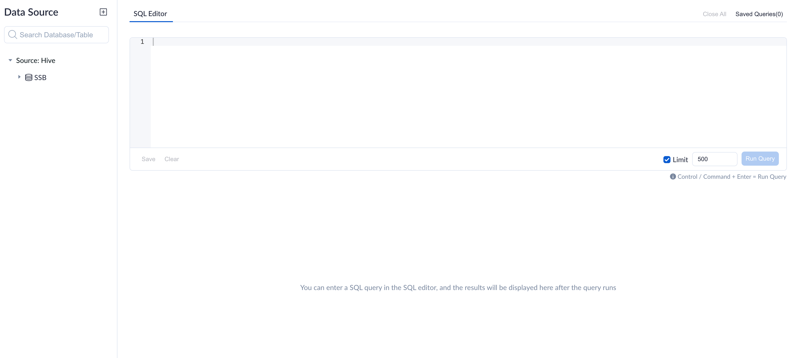
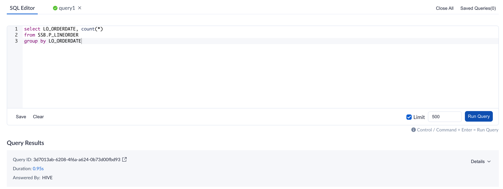
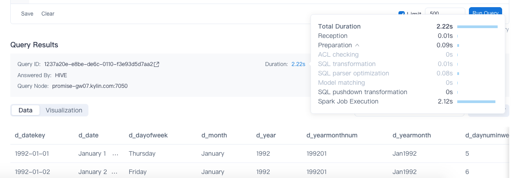
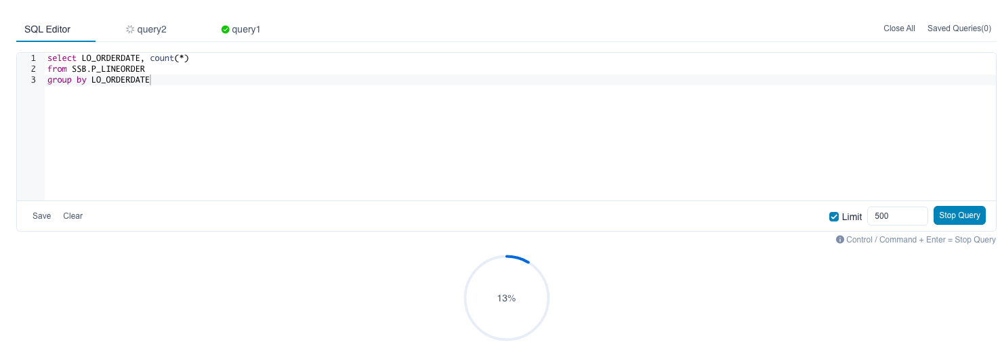
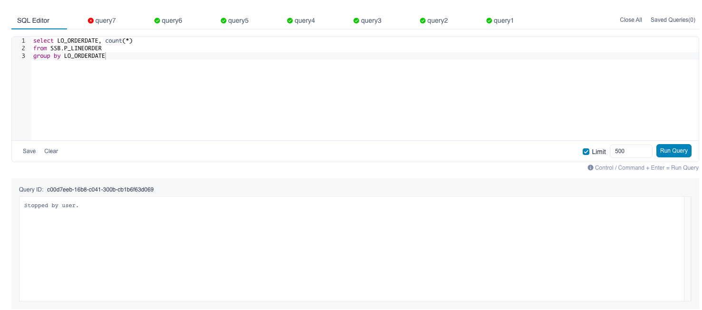
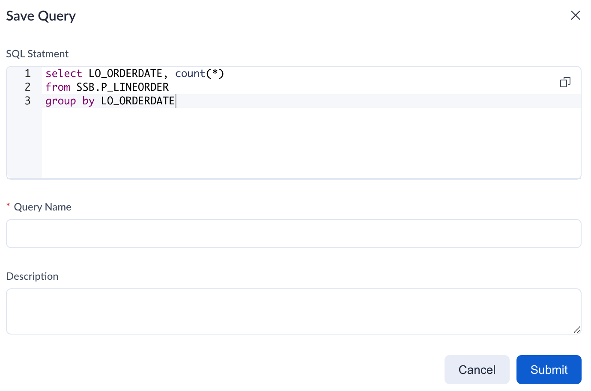
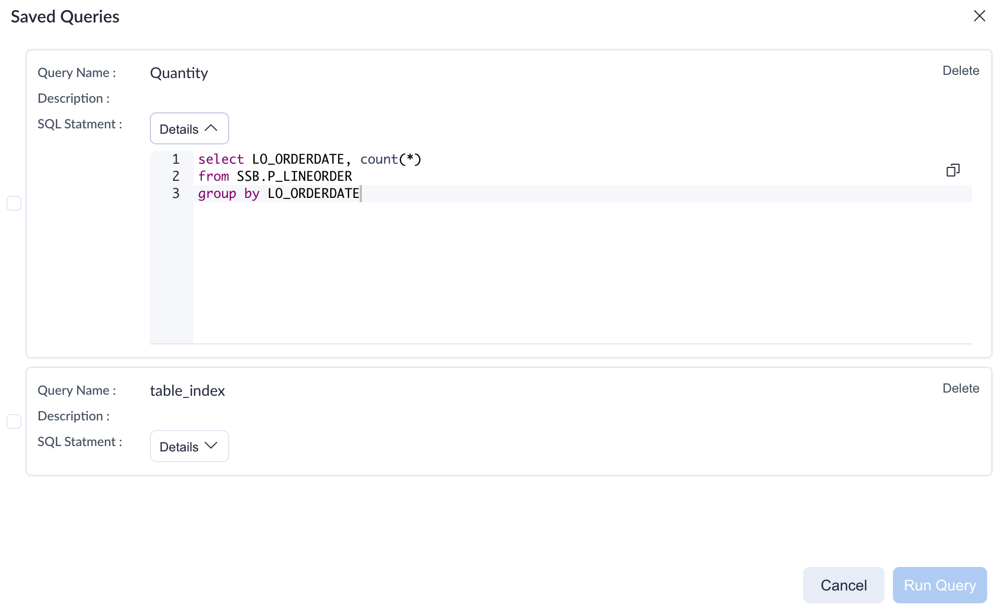
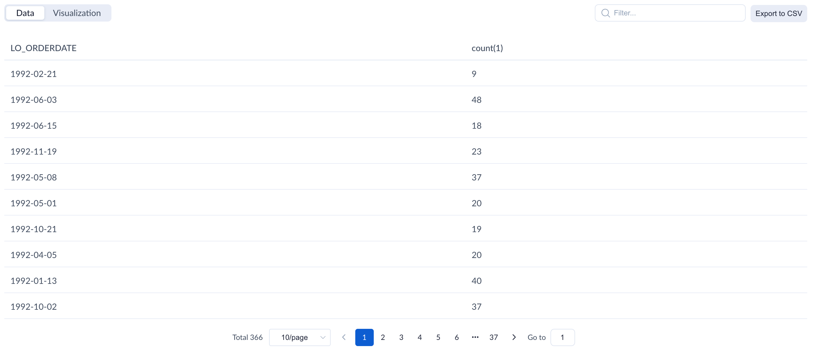
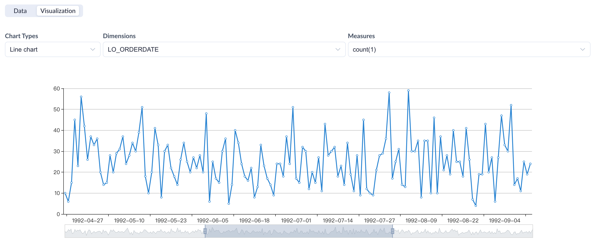

Open  kylin Web UI, click **Query -> Insight** button on the navigation bar, all query-able tables will be listed on the left side of page. Enter SQL in textbox on the right side of page, query result will be shown at the below textbox.




### Execute SQL Queries

Enter a select query and click **Run Query**, you will see query results. Note the **Limit** field at the bottom right of the page. If there's no limit clause in your SQL statement, the system will apply a default limit value, which is 500. You can uncheck the checkbox in front of the limit field, if you want to disable the limit utterly.

```sql
select LO_ORDERDATE, count(*)
from SSB.P_LINEORDER
group by LO_ORDERDATE
```

After query results returned successfully, you can find that the query execution time is about 0.96 seconds, and the query hits the model.

At the same time, you can see that the query ID is followed by an arrow. Click the arrow to open the query page in the Spark UI. On this page, you can easily see the SQL execution in Spark.



When you need to optimize for slow queries, you should analyze the query's specific execution steps and locate the reasons. It would help if you hovered the mouse over the duration to see the current query's detailed execution steps and duration.



> **Note**:
>
> 1. Only **SELECT** queries are supported.
> 2. When query pushdown is enabled, queries that cannot be served by model (index group) will be routed to the pushdown engine for execution. In this case, it will take longer to return and the query may be answered by Hive.
> 3. If the query does not need Spark calculation, such as hitting the query cache, constant query, etc. There will be no arrow followed by the query ID.
> 4. When the query uses tiered storage, the total scan counts needs to be obtained manually.

### Stop query

After clicking the **Run Query** button, click the **Stop** button in the same position to stop the query.



After the query is stopped, query ID and error message will be displayed.




In addition, clicking the **Close** button of the query will also stop the query.

### Save Query

User could click **Save SQL** button at bottom right corner to save queries, the queries are associated with the current user. Click the **Save Query** button below the SQL Editor and you will be prompted to enter a *Query Name* and a *Description* in the pop-up window to save the query.



### Saved Query
Click the **Saved Queries** button at the top right of the SQL Editor to view all saved queries. A list of saved queries will be shown in the pop-up window. You can check the box in front of the query and click the **Run Query** button to re-execute.




### Query Result

kylin displays query result in table by default. You can search for the query content in the **Filter box** at the top right of the query result, which is a fuzzy search. If you enter `1992`, each line in the query result will contain `1992`, as shown below is the daily order volume in year 1992. You can also export query results to a CSV file.




### Query Visualization

In addition to tables, kylin also supports visualization of query results for quick insight.

Support chart type: Line Chart, Bar Chart, Pie Chart.



### Other ways to execute SQL queries

- [Integration with BI tools](../../integration/intro.md)(Details doc will come soon.)

### Notices

- If a query can be answered by both index and snapshot, snapshot answers the query.
