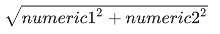

| Syntax               | Description                                                | Example                  | Normal Query      | Pushdown Query    | Defined as Computed Column | Suggested as Computed Column |
| ------------------------------ | ------------------------------------------------------------ | ---------------------------- | ---------------------------- | ---------------------------- | ---------------------------- | -- |
| ABS(numeric)                   | Returns the absolute value of *numeric*                      | `ABS(-2)` = 2  | ✔️ | ✔️ | ✔️ | ✔️ |
| CEIL(numeric)                  | Rounds *numeric* up, returning the smallest integer that is greater than or equal to *numeric* | ` CEIL(-2.2)` = -2 | ✔️ | ✔️ | ✔️ | ✔️ |
| FLOOR(numeric)                 | Rounds *numeric* down, returning the largest integer that is less than or equal to *numeric* | ` FLOOR(-2.2)` = -3 | ✔️ | ✔️ | ✔️ | ✔️ |
| MOD(numeric1, numeric2)        | Returns the remainder (modulus) of *numeric1* divided by *numeric2*. The result is negative only if *numeric1* is negative | `MOD(-3, 2)` = -1 | ✔️ | ✔️ | ❌ | ❌ |
| SQRT(numeric)                  | Returns the square root of *numeric*                         | `SQRT(16)` = 4.0 | ✔️ | ✔️ | ✔️ | ❌ |
| CBRT(numeric)                  | Returns the cube root of *numeric*.                          | ` CBRT(27.0)` = 3.0 | ✔️ | ✔️ | ✔️ | ✔️ |
| HYPOT(numeric1, numeric2)      | Returns  | ` HYPOT(3, 4)` = 5.0 | ✔️ | ✔️ | ✔️ | ✔️ |
| LN(numeric)                    | Returns the natural logarithm (base *e*) of *numeric*        | ` LN(2)` = 0.6931471805599453 | ✔️ | ✔️ | ✔️ | ✔️ |
| LOG(base, numeric)             | Returns the logarithm of *numeric* with *base*.              | ` LOG(10, 100)` = 2.0 | ✔️ | ✔️ | ✔️ | ✔️ |
| LOG10(numeric)                 | Returns the base 10 logarithm of *numeric*                   | ` LOG10(100)` = 2.0 | ✔️ | ✔️ | ✔️ | ✔️ |
| LOG1P(numeric)                 | Returns ln(1 + *numeric*).                                   | ` LOG1P(0)` = 0.0 | ✔️ | ✔️ | ✔️ | ✔️ |
| LOG2(numeric)                  | Returns the logarithm of *numeric* with base 2.              | ` LOG2(2)` = 1.0 | ✔️ | ✔️ | ✔️ | ✔️ |
| EXP(numeric)                   | Returns *e* raised to the power of *numeric*                 | ` EXP(1)` = 2.718281828459045 | ✔️ | ✔️ | ✔️ | ✔️ |
| EXPM1(numeric)                 | Returns exp(*numeric*) - 1.                                  | ` EXPM1(0)` = 0.0 | ✔️ | ✔️ | ✔️ | ✔️ |
| POWER(numeric1, numeric2)      | Returns *numeric1* raised to the power of *numeric2*         | `POWER(5,2)` = 25.0 | ✔️ | ✔️ | ✔️ | ✔️ |
| RAND([seed])                   | Generates a random double between 0 and 1 inclusive, optionally initializing the random number generator with *seed* | ` RAND(15)` = 0.45951471073476047 | ❌ | ✔️ | ❌ | ❌ |
| COS(numeric)                   | Returns the cosine of *numeric*                              | ` COS(5)`= 0.28366218546322625 | ✔️ | ✔️ | ✔️ | ✔️ |
| SIN(numeric)                   | Returns the sine of *numeric*                                | ` SIN(5)`= -0.9589242746631385 | ✔️ | ✔️ | ✔️ | ✔️ |
| TAN(numeric)                   | Returns the tangent of *numeric*                             | ` TAN(5)` = -3.380515006246586 | ✔️ | ✔️ | ✔️ | ✔️ |
| COT(numeric)                   | Returns the cotangent of *numeric*                           | ` COT(5)` = -0.2958129155327455 | ✔️ | ✔️ | ✔️ | ✔️ |
| ACOS(numeric)                  | Returns the arc cosine of *numeric*                          | ` ACOS(0.8)` = 0.6435011087932843 | ✔️ | ✔️ | ✔️ | ✔️ |
| ASIN(numeric)                  | Returns the arc sine of *numeric*                            | ` ASIN(0.8)` = 0.9272952180016123 | ✔️ | ✔️ | ✔️ | ✔️ |
| ATAN(numeric)                  | Returns the arc tangent of *numeric*                         | ` ATAN(0.8)` = 0.6747409422235527 | ✔️ | ✔️ | ✔️ | ✔️ |
| ATAN2(numeric1, numeric2)      | Returns the arc tangent of the *numeric*coordinates          | ` ATAN2(0.2, 0.8)` = 0.24497866312686414 | ✔️ | ✔️ | ✔️ | ✔️ |
| COSH(numeric)                  | Returns the hyperbolic cosine of *numeric*   | ` COSH(0)` = 1.0 | ✔️ | ✔️ | ✔️ | ✔️ |
| SINH(numeric)                  | Returns hyperbolic sine of *numeric*         | ` SINH(0)` = 0.0 | ✔️ | ✔️ | ✔️ | ✔️ |
| TANH(numeric)                  | Returns the hyperbolic tangent of *numeric*  | ` TANH(0)` = 0.0 | ✔️ | ✔️ | ✔️ | ✔️ |
| DEGREES(numeric)               | Converts *numeric* from radians to degrees                   | ` DEGREES(5)` = 286.4788975654116 | ✔️ | ✔️ | ✔️ | ✔️ |
| PI                             | Returns a value that is closer than any other value to *pi*  | ` PI` = 3.141592653589793           | ✔️         | ❌          | ❌          | ❌ |
| RADIANS(numeric)               | Converts *numeric* from degrees to radians                   | ` RADIANS(90)`= 1.5707963267948966 | ✔️ | ✔️ | ✔️ | ✔️ |
| BROUND(numeric1, int1)         | Returns *numeric1* rounded to *int1* decimal places using HALF_EVEN rounding mode.            | ` BROUND(2.5, 0)` = 2.0 | ✔️ | ✔️ | ✔️ | ✔️ |
| ROUND(numeric1, int1)          | Returns *numeric1* rounded to *int1* decimal places using HALF_UP rounding mode.               | ` ROUND(2.5, 0) =` = 3 | ✔️ | ✔️ | ✔️ | ✔️ |
| RINT(numeric)                  | Returns the double value that is closest in value to the argument and is equal to a mathematical integer. | ` RINT(12.3456)` = 12.0 | ✔️ | ✔️ | ✔️ | ✔️ |
| SIGN(numeric)                  | Returns the signum of *numeric*                              | ` SIGN(-5)` = -1.0 | ✔️ | ✔️ | ✔️ | ✔️ |
| CONV(numeric, from_base, to_base)     | Convert *numeric* from base *from_base* to base *to_base*. | ` CONV(-10, 16, -10)` = -16 | ✔️ | ✔️ | ✔️ | ✔️ |
| CONV(string, from_base, to_base)      | Convert *numeric* (type string) from base *from_base* to base *to_base*. | ` CONV('100', 2, 10)`= 4 | ✔️ | ✔️ | ✔️ | ✔️ |
| TRUNCATE(numeric1, numeric2)   | Truncates *numeric1* to optionally *numeric2*(if not specified 0) places right to the decimal point | ` TRUNCATE(5.55555,2)`= 5.5 | ✔️ | ✔️ | ✔️ | ✔️ |
| FACTORIAL(numeric)             | Returns the factorial of *numeric*. expr is [0..20]. Otherwise, null. | ` FACTORIAL(5)` = 120 | ✔️ | ✔️ | ✔️ | ✔️ |

**Notice**:  if the parameter of the `POWER` function is a constant conversion, like `CAST(2 AS DOUBLE)`, it may fail to be recommended as computed column.
