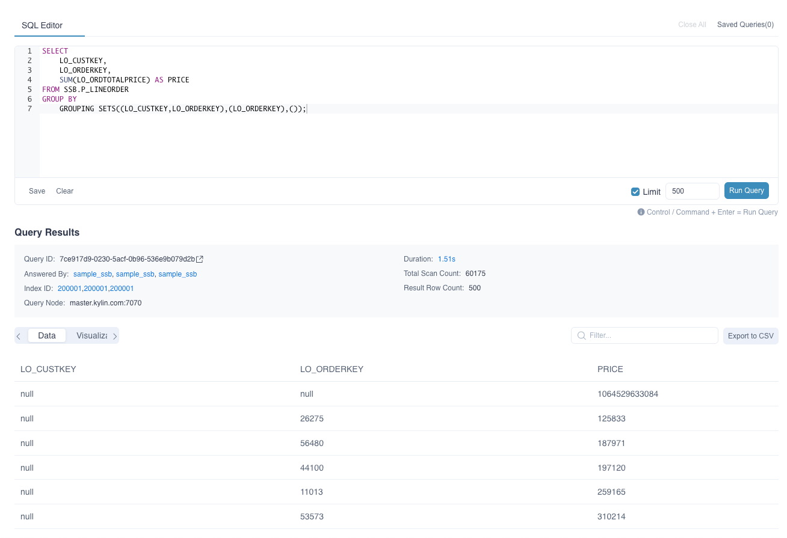
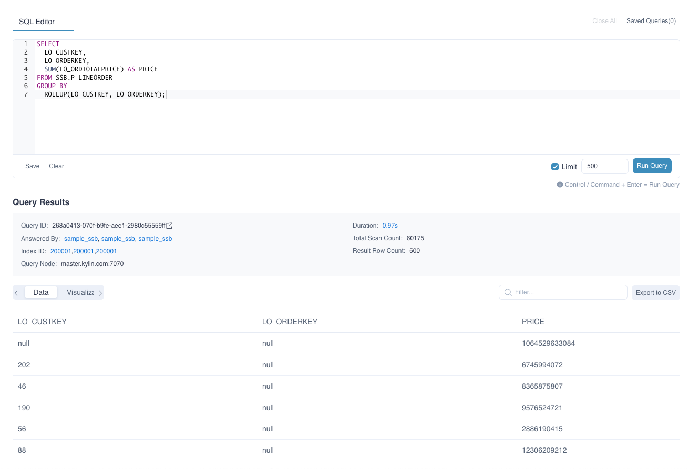
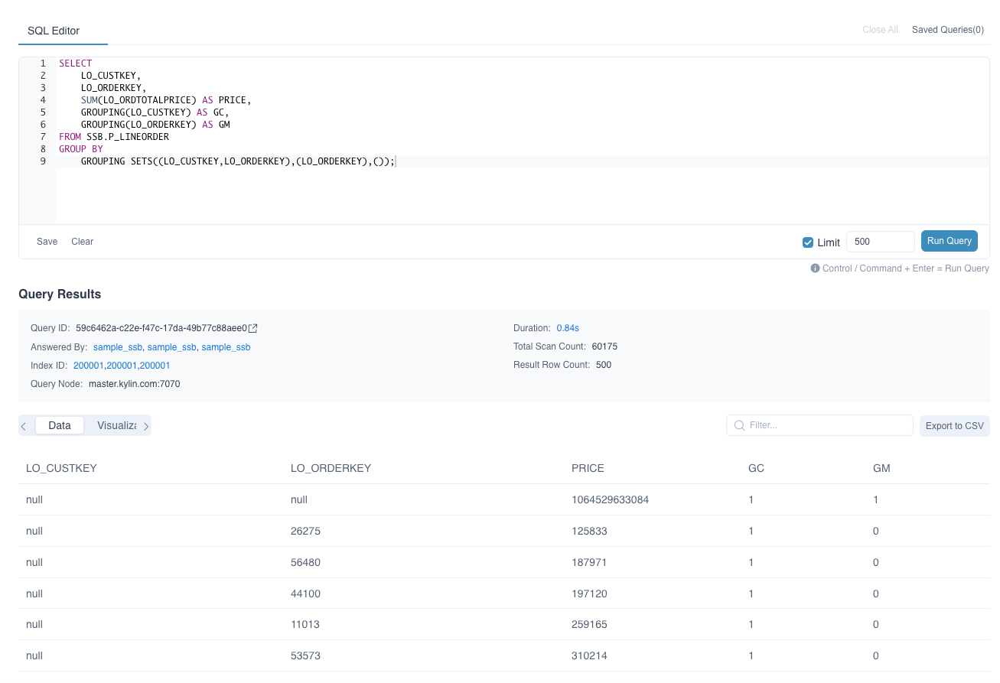

Users can use grouping function to aggregate data grouping by different keys in one SQL statement. ROLLUP, CUBE, GROUPING SETS functions are common grouping and aggregate methods.

>  **Note:** Grouping function is not supported to be defined or recommended as computed columns in current version.

### GROUPING SETS(expression)

In a result set, you sometimes need to aggregate columns A and B separately, and also aggregate the two columns together. The implementation method is often to use multiple UNION ALL statements. However, the GROUPING SETS function can use different grouping settings for aggregate queries at the same time. It can replace multiple UNION ALL statements, making SQL statements more convenient and efficient.

- Description

  - The GROUPING SETS function is often used in the GROUP BY clause. The expression is filled with the combination of dimensions that need to be grouped. For example, GROUPING SETS ((A, B), (C), ()) means to do aggregation with both columns A and B, aggregation with column C and aggregation with no grouping.
- Query Example 

```SQL
SELECT 
	LO_CUSTKEY, 
	LO_ORDERKEY, 
	SUM(LO_ORDTOTALPRICE) AS PRICE
FROM SSB.P_LINEORDER
GROUP BY 
	GROUPING SETS((LO_CUSTKEY,LO_ORDERKEY),(LO_ORDERKEY),());
```

- Result Example



### CUBE(expression) 和 ROLLUP(expression)

CUBE and ROLLUP functions can be considered special cases of GROUPING SETS.

- Description
  - CUBE will do group aggregation with all columns, and finally give the total aggregation result. The columns used in the expression are parsed into all possible combinations. For example, GROUP BY CUBE (a, b, c) is equivalent to GOUPING SETS ((a, b, c), (a, b), (a, c), (b, c), (a), (b) , (c), ())
  - ROLLUP will do group aggregation with the first column, and finally give the total aggregation. The columns used in the expression will be parsed into a combination form containing levels. For example, GROUP BY ROLLUP (a, b, c) is equivalent to GROUPING SETS ((a, b, c), (a, b), (a), ())
- Query Example (Here ROLLUP is taken as an example)

```SQL
SELECT
  LO_CUSTKEY,
  LO_ORDERKEY,
  SUM(LO_ORDTOTALPRICE) AS PRICE
FROM SSB.P_LINEORDER
GROUP BY
  ROLLUP(LO_CUSTKEY, LO_ORDERKEY);
```

- Result Example




### GROUPING(expression)

In the results created using the grouping functions, NULL is used as a placeholder, so when you view the results, you cannot distinguish between NULL as a placeholder or the original data.

The GROUPING function distinguishes the placeholder NULL from the NULL in the original data.

- Description
	- The grouping columns involved in the grouping function can be used in the expression of the GROUPING function. If the function returns a value of 0, it means that the NULL displayed under the grouping column in the corresponding row is from the original data. If it returns 1, it means that the NULL displayed under the grouping column in the corresponding row is a placeholder generated by the grouping function. 
- Query Example 

```SQL
SELECT 
	LO_CUSTKEY,
	LO_ORDERKEY,
	SUM(LO_ORDTOTALPRICE) AS PRICE,
	GROUPING(LO_CUSTKEY) AS GC,
	GROUPING(LO_ORDERKEY) AS GM
FROM SSB.P_LINEORDER
GROUP BY 
	GROUPING SETS((LO_CUSTKEY,LO_ORDERKEY),(LO_ORDERKEY),());
```

- Result Example:

You can see that the result of the GROUPING function in both columns in the first row is 1, indicating that the NULL in the two columns LO_CUSTKEY and LO_ORDERKEY in this row are placeholders due to the GROUPING SETS function.


