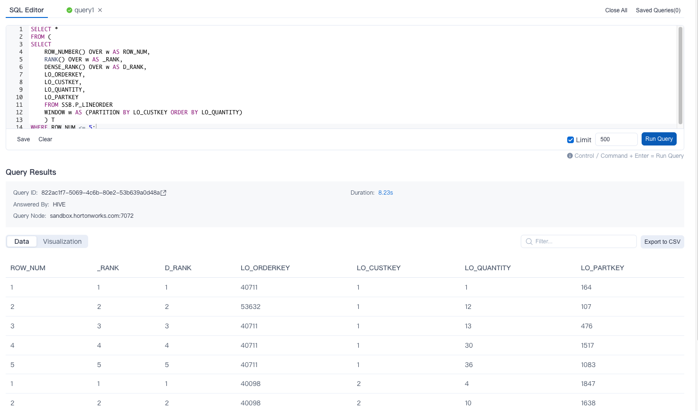
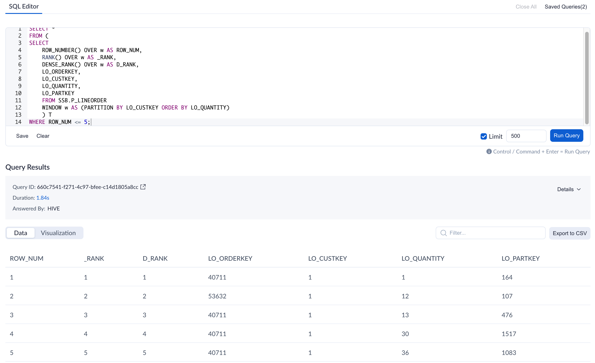
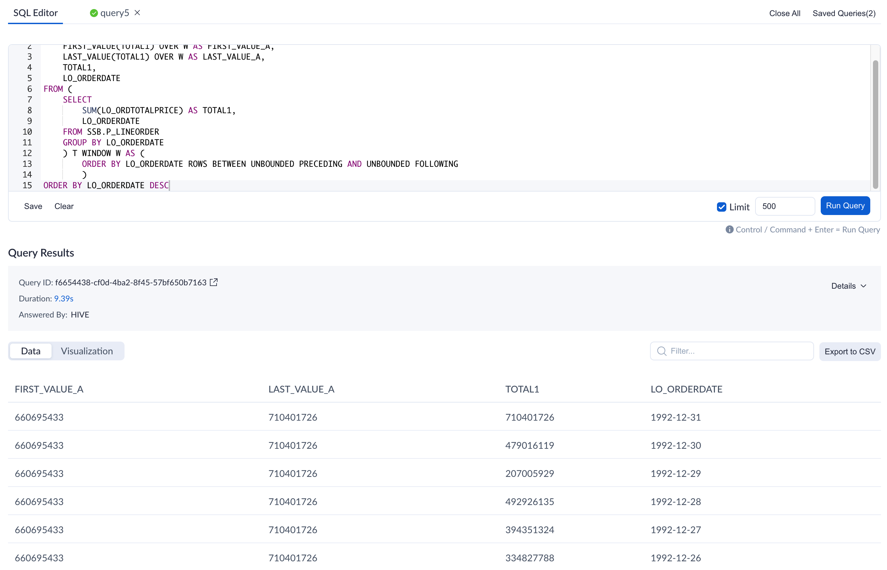
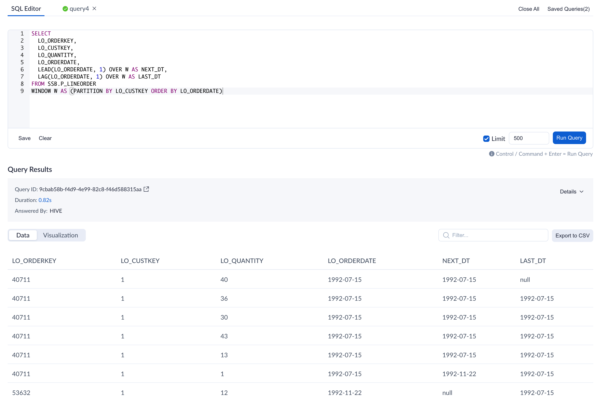

You can use window function to simplify the query process and analyze more complicated scenarios with a better performance.

> **Note:** Window functions are currently not supported to be defined or recommended as computed columns.

### Syntax structure

- function(value) OVER window
- The composition of the window:
  - *partition by*: group clause, which represents the calculation range of the window function.
  - *order by*: sort clause, indicating the sorting method within the group after partition.
  - *rows/range*:  window clause, indicating that after partition, a sliding data window is determined in the group. The window functions will do calculation based on the data range contained in the window.
    - *rows* is a physical window, that is, the fixed before and after records of the current row number are selected according to the results sorted by the *order by* clause. The result of this clause has nothing to do with the value of the current row, but the sorted row number. 
      - Take SQL sum (column A) rows between 1 preceding and 2 following as an example. If the *column A* of the current row is sorted with a sorted row number of 3, then this clause will select the records where the sequence number of *column A* lies between 2 and 5.
    -  *range* is a logical window, that is, based on the value of the current row, the fixed before and after records of the value of the current row are selected. The result of this clause has nothing to do with the sorted row number, but the value of the row.
      - Take SQL sum (column A) range between 1 preceding and 2 following as an example. If the value of *column A* is 3, then this clause will select the records where the value of *column A* lies between between 2 and 5.
    - If an *order by* clause is specified without window clause, the default window clause is equal to SQL range between unbounded preceding and current row.

### Examples of window functions

And then we'll illustrate the usage of every single window function with table *P_LINEORDER* in the [sample dataset](../../../../quickstart/sample_dataset.md), where you may also find the fields and corresponding descriptions.

- **ROW_NUMBER**

  - Function description: ROW_NUMBER() OVER window, returning the position of the current row in its partition, the sequence numbers are not repeated.

- **RANK**

  - Function description: RANK() OVER window, returning the position of the current row in its partition, possibly with sequence gaps.

- **DENSE_RANK**

  - Function description: DENSE_RANK() OVER window, returning the position of the current row in its partition with no sequence gaps.

- **Query Example**
  For comparison, we use RANK () and DENSE_RANK () and ROW_NUMBER () in the same query to query the first five orders with the least number of items purchased by each buyer. The query is as follows:

  ```SQL
  SELECT *
  FROM (
  SELECT 
      ROW_NUMBER() OVER w AS ROW_NUM,
      RANK() OVER w AS _RANK,
      DENSE_RANK() OVER w AS D_RANK,
      LO_ORDERKEY,
      LO_CUSTKEY,
      LO_QUANTITY,
      LO_PARTKEY
      FROM SSB.P_LINEORDER 
      WINDOW w AS (PARTITION BY LO_CUSTKEY ORDER BY LO_QUANTITY)
      ) T
  WHERE ROW_NUM <= 5;
  ```

- **Result**
  

- **Result Explanation**
  For buyer with id '1', there are four orders with quantity of 1, and the above three functions are compared as follows:

  - When using row_number() function, orders with *LO_QUANTITY* as 1 are ranked as 1, 2, 3, 4, and the order with *LO_QUANTITY* as 2 is ranked as 5.
  
  - When using rank() function, orders with *LO_QUANTITY* as 1 are ranked as 1, 1, 1, 1, and the order with *LO_QUANTITY* as 2 is ranked as 5, which exists sequence gaps.
  
  - When using dense_rank() function, orders with *LO_QUANTITY* as 1 are ranked as 1, 1, 1, 1, and the order with *LO_QUANTITY* as 2 is ranked as 2, which does not exist sequence gaps.


- **NTILE**

  - Function description: NTILE(value) OVER window, returning an integer ranging from 1 to value, dividing the partition as equally as possible

- **Query Example**
  The orders of each buyer are divided into 3 groups according to the number of purchased products. In order to display the search results completely, the orders with the number of products greater than or equal to 48 are selected for grouping.

  ```SQL
  SELECT 
      NTILE(3) OVER w AS N_3,
      LO_ORDERKEY,
      LO_CUSTKEY,
      LO_QUANTITY,
      LO_PARTKEY
  FROM SSB.P_LINEORDER
  WHERE LO_QUANTITY >= 48
WINDOW w AS (PARTITION BY LO_CUSTKEY ORDER BY LO_QUANTITY);
  ```

- **Result**
  

  
  
- **FIRST_VALUE**
  
  - Function description: FIRST_VALUE(value) OVER window, returning value evaluated at the row that is the first row of the window frame

- **LAST_VALUE**
  
  - Function description: LAST_VALUE(value) OVER window, returning value evaluated at the row that is the last row of the window frame

- **Query Sample**
  Query the first order and the last order with the highest total price sorted by date.

  ```SQL
  SELECT 
      FIRST_VALUE(TOTAL1) OVER W AS FIRST_VALUE_A,
      LAST_VALUE(TOTAL1) OVER W AS LAST_VALUE_A,
      TOTAL1,
      LO_ORDERDATE
  FROM (
  	SELECT 
  	    SUM(LO_ORDTOTALPRICE) AS TOTAL1,
  	    LO_ORDERDATE
  	FROM SSB.P_LINEORDER
  	GROUP BY LO_ORDERDATE
  	) T WINDOW W AS (
  		ORDER BY LO_ORDERDATE ROWS BETWEEN UNBOUNDED PRECEDING AND UNBOUNDED FOLLOWING
  		)
  ORDER BY LO_ORDERDATE DESC
  ```

- **Result**
  


- **LEAD()**
  
  - Function description: LEAD(value, offset, default) OVER window, returning the offset row backwards from the current row in the partition. *value* represents the column as the current value, *offset* represents the number that needs to be searched for the offset row backwards based on the current value, and *default* represents the value returned by default when there is no eligible value, and null is returned by default if not filled.
- **LAG()**
  
  - Function description: LAG(value, offset, default) OVER window, returning the forward offset of the current row in the partition. *value* represents the field as the column value, *offset* represents the number that needs to be looked up in the offset row forwards based on the current value, *default* represents the value returned by default when there is no eligible value, and null is returned by default if not filled.

- **Query Sample**
  Query the time of last order and next order based on current order.

  ```SQL
  SELECT
    LO_ORDERKEY,
    LO_CUSTKEY,
    LO_QUANTITY,
    LO_ORDERDATE,
    LEAD(LO_ORDERDATE, 1) OVER W AS NEXT_DT,
    LAG(LO_ORDERDATE, 1) OVER W AS LAST_DT
  FROM SSB.P_LINEORDER
  WINDOW W AS (PARTITION BY LO_CUSTKEY ORDER BY LO_ORDERDATE)
  ```

- **Result**
  
