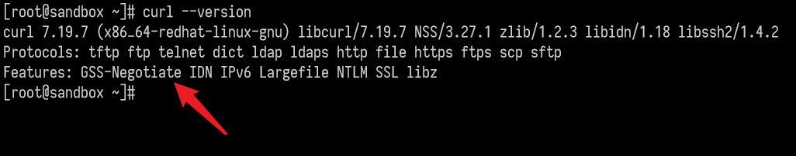
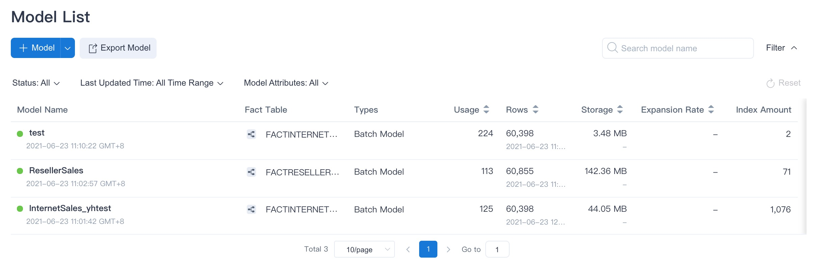
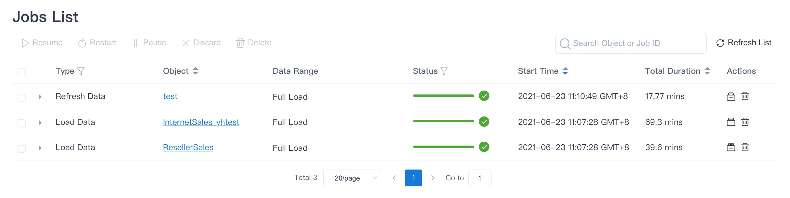
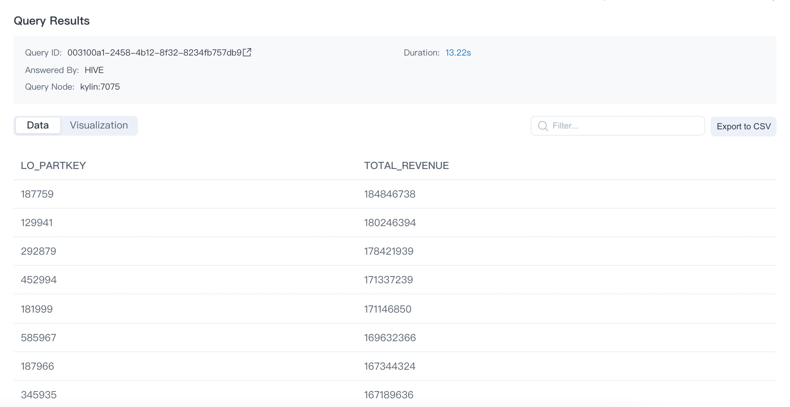

In this guide, we will explain how to quickly install and start Kylin 5. Before you begin, ensure you have met the [Prerequisites](../deployment/prerequisite.md).

## <span id="docker">Play Kylin in docker</span>

To explore new features in Kylin 5 on a laptop, we recommend pulling the Docker image and checking the [Apache Kylin Standalone Image on Docker Hub](https://hub.docker.com/r/apachekylin/apache-kylin-standalone) (For amd64 platform).

```shell
docker run -d \
    --name Kylin5-Machine \
    --hostname localhost \
    -e TZ=UTC \
    -m 10G \
    -p 7070:7070 \
    -p 8088:8088 \
    -p 9870:9870 \
    -p 8032:8032 \
    -p 8042:8042 \
    -p 2181:2181 \
    apachekylin/apache-kylin-standalone:5.0.2-GA
```

## <span id="install">Install Kylin in Single Node</span>


### <span id="start">Start Kylin</span>

1. Check the version of `curl`.

   Since `check-env.sh` needs to rely on the support of GSS-Negotiate during the installation process, it is recommended that you check the relevant components of your curl first. You can use the following commands in your environment:

   ```shell
   curl --version
   ```
   If GSS-Negotiate is displayed in the interface, the curl version is available. If not, you can reinstall curl or add GSS-Negotiate support.
   

2. Start Kylin with the startup script.
   Run the following command to start Kylin. When it is first started, the system will run a series of scripts to check whether the system environment has met the requirements. For details, please refer to the [Environment Dependency Check](../operations/system-operation/cli_tool/environment_check) chapter.

   ```shell
   ${KYLIN_HOME}/bin/kylin.sh start
   ```
   > **Note**：If you want to observe the detailed startup progress, run:
   >
   > ```shell
   > tail -f $KYLIN_HOME/logs/kylin.log
   > ```


Once the startup is completed, you will see information prompt in the console. Run the command below to check the Kylin process at any time.

   ```shell
   ps -ef | grep kylin
   ```

3. Get login information.

   After the startup script has finished, the random password of the default user `ADMIN` will be displayed on the console. You are highly recommended to save this password. If this password is accidentally lost, please refer to [ADMIN User Reset Password](../operations/access-control/user_management.md).

### <span id="use">How to Use</span>

After Kylin is started, open web GUI at `http://{host}:7070/kylin`. Please replace `host` with your host name, IP address, or domain name. The default port is `7070`.

The default user name is `ADMIN`. The random password generated by default will be displayed on the console when Kylin is started for the first time. After the first login, please reset the administrator password according to the password rules.

- At least 8 characters.
- Contains at least one number, one letter, and one special character ```(~!@#$%^&*(){}|:"<>?[];',./`)```.

Kylin uses the open source **SSB** (Star Schema Benchmark) dataset for star schema OLAP scenarios as a test dataset. You can verify whether the installation is successful by running a script to import the SSB dataset into Hive. The SSB dataset is from multiple CSV files.

**Import Sample Data**

Run the following command to import the sample data:

```shell
$KYLIN_HOME/bin/sample.sh
```

The script will create 1 database **SSB** and 6 Hive tables then import data into it.

After running successfully, you should be able to see the following information in the console:

```shell
Sample hive tables are created successfully
```


We will be using SSB dataset as the data sample to introduce Kylin in several sections of this product manual. The SSB dataset simulates transaction data for the online store, see more details in [Sample Dataset](./tutorial.md#ssb). Below is a brief introduction.


| Table       | Description                           | Introduction                                                 |
| ----------- | ------------------------------------- | ------------------------------------------------------------ |
| CUSTOMER    | customer information                  | includes customer name, address, contact information .etc.   |
| DATES       | order date                            | includes a order's specific date, week, month, year .etc.    |
| LINEORDER   | order information                     | includes some basic information like order date, order amount, order revenue, supplier ID, commodity ID, customer Id .etc. |
| PART        | product information                   | includes some basic information like product name, category, brand .etc. |
| P_LINEORDER | view based on order information table | includes all content in the order information table and new content in the view |
| SUPPLIER    | supplier information                  | includes supplier name, address, contact information .etc.   |


**Validate Product Functions**

You can create a sample project and model according to [Kylin 5 Tutorial](tutorial.md). The project should validate basic features such as source table loading, model creation, index build etc.

On the **Data Asset -> Model** page, you should see an example model with some storage over 0.00 KB, this indicates the data has been loaded for this model.



On the **Monitor** page, you can see all jobs have been completed successfully in **Batch Job** pages.



**Validate Query Analysis**

When the metadata is loaded successfully, at the **Insight** page, 6 sample hive tables would be shown at the left panel. User could input query statements against these tables. For example, the SQL statement queries different product group by order date, and in descending order by total revenue:

```sql
SELECT LO_PARTKEY, SUM(LO_REVENUE) AS TOTAL_REVENUE
FROM SSB.P_LINEORDER
WHERE LO_ORDERDATE between '1993-06-01' AND '1994-06-01'
group by LO_PARTKEY
order by SUM(LO_REVENUE) DESC
```


The query result will be displayed at the **Insight** page, showing that the query hit the sample model.



You can also use the same SQL statement to query on Hive to verify the result and performance.


### <span id="stop">Stop Kylin</span>

Run the following command to stop Kylin:

```shell
$KYLIN_HOME/bin/kylin.sh stop
```

You can run the following command to check if the Kylin process has stopped.

```shell
ps -ef | grep kylin
```

### <span id="faq">FAQ</span>

**Q: How do I change the service default port?**

You can modify the following configuration in the `$KYLIN_HOME/conf/kylin.properties`, here is an example for setting the server port to 7070.

```properties
server.port=7070
```

**Q: Is the query pushdown engine turned on by default?**

Yes, if you want to turn it off, please refer to [Pushdown to SparkSQL](../query/push_down.md).

