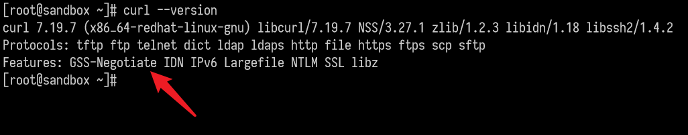
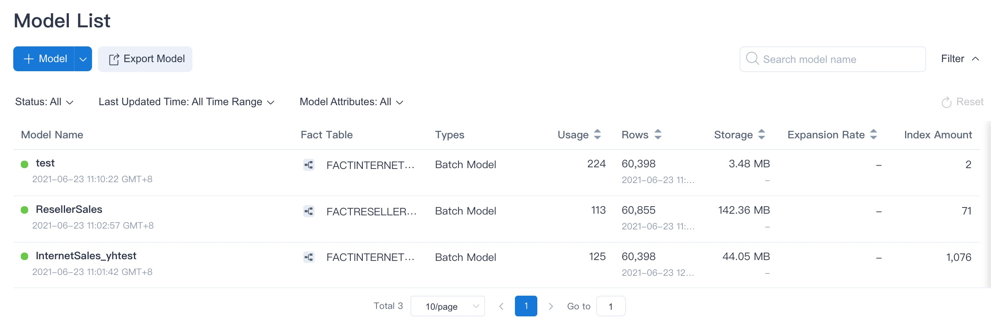
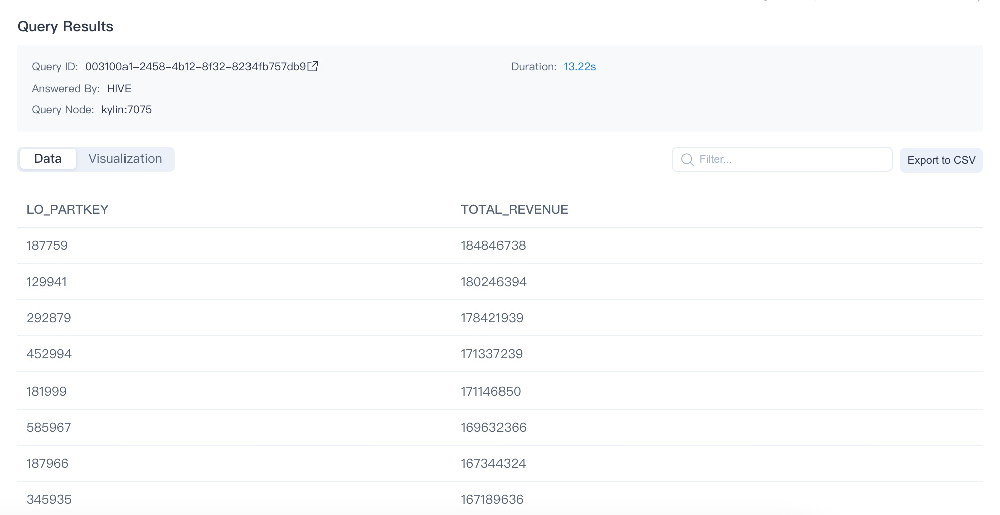

In this guide, we will explain how to quickly install and start Kylin 5.

Before proceeding, please make sure the [Prerequisite](../deployment/on-premises/prerequisite.md) is met.


### <span id="install">Download and Install</span>

1. Get Kylin installation package.

   Please refer to [How To Package](../development/how_to_package.md).

2. Decide the installation location and the Linux account to run Kylin. All the examples below are based on the following assumptions:

   - The installation location is `/usr/local/`
   - Linux account to run Kylin is `KyAdmin`. It is called the **Linux account** hereafter.
   - **For all commands in the rest of the document**, please replace the above parameters with your real installation location and Linux account. 

3. Copy and uncompress Kylin software package to your server or virtual machine.

   ```shell
   cd /usr/local
   tar -zxvf Kylin5.0-Beta-[Version].tar.gz
   ```
   The decompressed directory is referred to as **$KYLIN_HOME** or **root directory**.

5. Prepare RDBMS metastore.

   If PostgreSQL or MySQL has been installed already in your environment, you can choose one of them as the metastore. 
   
   **Note**: 
   
   + For the production environment, we recommend to setup a dedicated metastore. You can use PostgreSQL which is shipped with Kylin 5.x. 
   + The database name of metastore **must start with an English character**.
   
   Please refer to the below links for complete steps to install and configure:
   
   * [Use PostgreSQL as Metastore](../deployment/on-premises/rdbms_metastore/postgresql/default_metastore.md).
   * [Use MySQL as Metastore](../deployment/on-premises/rdbms_metastore/mysql/mysql_metastore.md).
   
6. (optional) Install InfluxDB.
  
   Kylin uses InfluxDB to save various system monitoring information. If you do not need to view related information, you can skip this step. It is strongly recommended to complete this step in a production environment and use related monitoring functions.
   
   ```sh
   # download influxdb
   $KYLIN_HOME/sbin/download-influxdb.sh
   
   cd $KYLIN_HOME/influxdb
   
   # install influxdb
   rpm -ivh influxdb-1.6.5.x86_64.rpm
   ```
   
   For more details, please refer to [Use InfluxDB as Time-Series Database](../operations/monitoring/influxdb/influxdb.md).
   
6. Create a working directory on HDFS and grant permissions.

   The default working directory is `/kylin`. Also ensure the Linux account has access to its home directory on HDFS. Meanwhile, create directory `/kylin/spark-history` to store the spark log files.

   ```sh
   hadoop fs -mkdir -p /kylin
   hadoop fs -chown root /kylin
   hadoop fs -mkdir -p /kylin/spark-history
   hadoop fs -chown root /kylin/spark-history
   ```

   If necessary, you can modify the path of the Kylin working directory in `$KYLIN_HOME/conf/kylin.properties`.

   **Note**: If you do not have the permission to create `/kylin/spark-history`, you can configure `kylin.engine.spark-conf.spark.eventLog.dir` and `kylin.engine.spark-conf.spark.history.fs.logDirectory` with an available directory.

### <span id="configuration">Quick Configuration</span>

In the `conf` directory under the root directory of the installation package, you should configure the parameters in the file `kylin.properties` as follows:

1. According to the PostgreSQL configuration, configure the following metadata parameters. Pay attention to replace the corresponding ` {metadata_name} `, `{host} `, ` {port} `, ` {user} `, ` {password} ` value, the maximum length of `metadata_name` allowed is 28.

   ```properties
   kylin.metadata.url={metadata_name}@jdbc,driverClassName=org.postgresql.Driver,url=jdbc:postgresql://{host}:{port}/kylin,username={user},password={password}
   ```
   For more PostgreSQL configuration, please refer to [Use PostgreSQL as Metastore](../deployment/on-premises/rdbms_metastore/postgresql/default_metastore.md). For information for MySQL configuration, please refer to [Use MySQL as Metastore](../deployment/on-premises/rdbms_metastore/mysql/mysql_metastore.md). 

   > **Note**: please name the `{metadata_name}` with letters, numbers, or underscores. The name can't start with numbers, such as `1a` is illegal and `a1` is legal.

2. When executing jobs, Kylin will submit the build task to Yarn. You can set and replace `{queue}` in the following parameters as the queue you actually use, and require the build task to be submitted to the specified queue.

   ```properties
   kylin.engine.spark-conf.spark.yarn.queue={queue_name}
   ```


3. Configure the ZooKeeper service.

   Kylin uses ZooKeeper for service discovery, which will ensure that when an instance starts, stops, or unexpectedly interrupts communication during cluster deployment, other instances in the cluster can automatically discover and update the status. For more details, pleaser refer to [Service Discovery](../deployment/on-premises/deploy_mode/service_discovery.md).
   
   Please add ZooKeeper's connection configuration `kylin.env.zookeeper-connect-string=host:port`. You can modify the cluster address and port according to the following example.
   
   ```properties
   kylin.env.zookeeper-connect-string=10.1.2.1:2181,10.1.2.2:2181,10.1.2.3:2181
   ```
   
4. (optional) Configure Spark Client node information
   Since Spark is started in yarn-client mode, if the IP information of Kylin is not configured in the hosts file of the Hadoop cluster, please add the following configurations in `kylin.properties`:
    `kylin.storage.columnar.spark-conf.spark.driver.host={hostIp}`
    `kylin.engine.spark-conf.spark.driver.host={hostIp}`

  You can modify the {hostIp} according to the following example:
  ```properties
  kylin.storage.columnar.spark-conf.spark.driver.host=10.1.3.71
  kylin.engine.spark-conf.spark.driver.host=10.1.3.71
  ```


### <span id="start">Start Kylin</span>

1. Check the version of `curl`.

   Since `check-env.sh` needs to rely on the support of GSS-Negotiate during the installation process, it is recommended that you check the relevant components of your curl first. You can use the following commands in your environment:

   ```shell
   curl --version
   ```
   If GSS-Negotiate is displayed in the interface, the curl version is available. If not, you can reinstall curl or add GSS-Negotiate support.
   

2. Start Kylin with the startup script.
   Run the following command to start Kylin. When it is first started, the system will run a series of scripts to check whether the system environment has met the requirements. For details, please refer to the [Environment Dependency Check](../operations/system-operation/cli_tool/environment_dependency_check.md) chapter.
   
   ```shell
   ${KYLIN_HOME}/bin/kylin.sh start
   ```
   > **Note**：If you want to observe the detailed startup progress, run:
   >
   > ```shell
   > tail -f $KYLIN_HOME/logs/kylin.log
   > ```
   

Once the startup is completed, you will see information prompt in the console. Run the command below to check the Kylin process at any time.

   ```shell
   ps -ef | grep kylin
   ```

3. Get login information.

   After the startup script has finished, the random password of the default user `ADMIN` will be displayed on the console. You are highly recommended to save this password. If this password is accidentally lost, please refer to [ADMIN User Reset Password](../operations/access-control/user_management.md).

### <span id="use">How to Use</span>

After Kylin is started, open web GUI at `http://{host}:7070/kylin`. Please replace `host` with your host name, IP address, or domain name. The default port is `7070`. 

The default user name is `ADMIN`. The random password generated by default will be displayed on the console when Kylin is started for the first time. After the first login, please reset the administrator password according to the password rules.

- At least 8 characters.
- Contains at least one number, one letter, and one special character ```(~!@#$%^&*(){}|:"<>?[];',./`)```.

Kylin uses the open source **SSB** (Star Schema Benchmark) dataset for star schema OLAP scenarios as a test dataset. You can verify whether the installation is successful by running a script to import the SSB dataset into Hive. The SSB dataset is from multiple CSV files.

**Import Sample Data**

Run the following command to import the sample data:

```shell
$KYLIN_HOME/bin/sample.sh
```

The script will create 1 database **SSB** and 6 Hive tables then import data into it.

After running successfully, you should be able to see the following information in the console:

```shell
Sample hive tables are created successfully
```


We will be using SSB dataset as the data sample to introduce Kylin in several sections of this product manual. The SSB dataset simulates transaction data for the online store, see more details in [Sample Dataset](sample_dataset.md). Below is a brief introduction.


| Table       | Description                           | Introduction                                                 |
| ----------- | ------------------------------------- | ------------------------------------------------------------ |
| CUSTOMER    | customer information                  | includes customer name, address, contact information .etc.   |
| DATES       | order date                            | includes a order's specific date, week, month, year .etc.    |
| LINEORDER   | order information                     | includes some basic information like order date, order amount, order revenue, supplier ID, commodity ID, customer Id .etc. |
| PART        | product information                   | includes some basic information like product name, category, brand .etc. |
| P_LINEORDER | view based on order information table | includes all content in the order information table and new content in the view |
| SUPPLIER    | supplier information                  | includes supplier name, address, contact information .etc.   |


**Validate Product Functions**

You can create a sample project and model according to [Expert Mode Tutorial](expert_mode_tutorial.md). The project should validate basic features such as source table loading, model creation, index build etc. 

On the **Data Asset -> Model** page, you should see an example model with some storage over 0.00 KB, this indicates the data has been loaded for this model.



On the **Monitor** page, you can see all jobs have been completed successfully in **Batch Job** pages. 


**Validate Query Analysis**

When the metadata is loaded successfully, at the **Insight** page, 6 sample hive tables would be shown at the left panel. User could input query statements against these tables. For example, the SQL statement queries different product group by order date, and in descending order by total revenue: 

```sql
SELECT LO_PARTKEY, SUM(LO_REVENUE) AS TOTAL_REVENUE
FROM SSB.P_LINEORDER
WHERE LO_ORDERDATE between '1993-06-01' AND '1994-06-01' 
group by LO_PARTKEY
order by SUM(LO_REVENUE) DESC 
```


The query result will be displayed at the **Insight** page, showing that the query hit the sample model.



You can also use the same SQL statement to query on Hive to verify the result and performance.


### <span id="stop">Stop Kylin</span>

Run the following command to stop Kylin:

```shell
$KYLIN_HOME/bin/kylin.sh stop
```

You can run the following command to check if the Kylin process has stopped.

```shell
ps -ef | grep kylin
```

### <span id="faq">FAQ</span>

**Q: How do I change the service default port?**

You can modify the following configuration in the `$KYLIN_HOME/conf/kylin.properties`, here is an example for setting the server port to 7070.

```properties
server.port=7070
```

**Q: Does Kylin support Kerberos integration?**

Yes, if your cluster enables Kerberos authentication protocol, the Spark embedded in Kylin needs proper configuration to access your cluster resource securely. For more information, please refer to [Integrate with Kerberos](#TODO)(Details doc will come soon).

**Q: Is the query pushdown engine turned on by default?**

Yes, if you want to turn it off, please refer to [Pushdown to SparkSQL](../query/pushdown/pushdown_to_embedded_spark.md).

