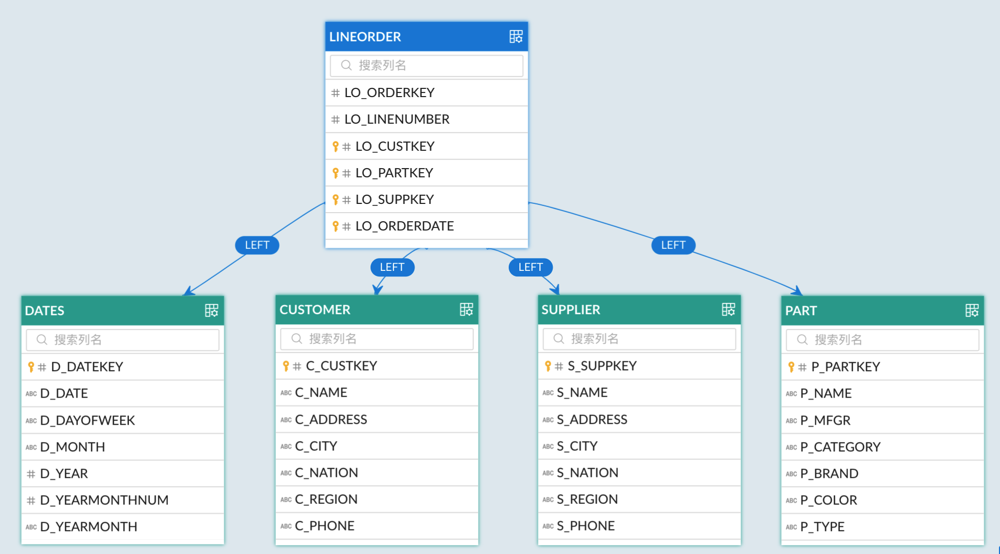

Kylin is embedded with a standard SSB dataset (approximately 5.9 MB) for testing or trying out different functions. This SSB dataset contains 5 tables and 1 view. LINEORDER serves as a central fact table with 60,175 rows of data. 

### Introduction

The following table lists the 5 tables and 1 view of SSB sample dataset.

| **Table**       | **Type**                 | **Description**                                              |
| --------------- | ------------------------ | ------------------------------------------------------------ |
| **LINEORDER**   | Fact table               | Contain detailed information about sales orders. Each row holds order information such as customer, supplier, order amount, and order date. |
| **P_LINEORDER** | View based on fact table | Contain details about sales orders and a pre-calculated row (V_REVENUE) with same transaction records as in LINEORDER. |
| **CUSTOMER**    | Dimension table          | Contain customer information, such as customer name, customer address, and customer city. |
| **SUPPLIER**    | Dimension table          | Contain supplier information, such as supplier name, supplier address, and supplier city. |
| **DATES**       | Dimension table          | Contain information about the dates of 7 years, such as beginning date of the year, beginning date of the month, and beginning date of the week. |
| **PART**        | Dimension table          | Contain part information, such as part name, part category, part color, and part type. |

The 5 tables together constitute the structure of the entire star data model. Below is an entity-relationship (E-R) diagram. 



Join Relationships:

```sql
P_LINEORDER INNER JOIN DATES ON P_LINEORDER.LO_ORDERDATE=DATES.D_DATEKEY
P_LINEORDER INNER JOIN CUSTOMER ON P_LINEORDER.LO_CUSTKEY=CUSTOMER.C_CUSTKEY
P_LINEORDER INNER JOIN PART ON P_LINEORDER.LO_PARTKEY=PART.P_PARTKEY
P_LINEORDER INNER JOIN SUPPLIER ON P_LINEORDER.LO_SUPPKEY=SUPPLIER.S_SUPPKEY
```

### Import and check sample dataset

1. Log on to the server command line, and run the following command to import the SSB sample dataset: 

   ```shell
   $KYLIN_HOME/bin/sample.sh
   ```

   > [!NOTE]
   >
   > Replace `KYLIN_HOME` with the actual path of Kylin.

2. To check sample dataset:

   1. In the terminal, run `hive` command to enter Hive CLI.

   2. Run the following commands sequentially to check information about databases and tables. 

      ```sql
      ## List all databases
      show databases;
      ## Enter database SSB
      use ssb;
      ## List all tables in database SSB 
      show tables;
      ## Query the number of records in table SUPPLIER 
      select count(*) from SUPPLIER;
      ```

### Appendix: Tables and columns  

#### LINEORDER

| Column           | Description                                    |
| ---------------- | ---------------------------------------------- |
| LO_ORDERKEY      | Order ID                                       |
| LO_CUSTKEY       | Customer ID                                    |
| LO_PARTKEY       | Part ID                                        |
| LO_SUPPKEY       | Supplier ID                                    |
| LO_ORDERDATE     | Order date                                     |
| LO_ORDERPRIORITY | Order priority                                 |
| LO_SHIPPRIORITY  | Ship priority                                  |
| LO_LINENUMBER    | Compound primary key: L_ORDERKEY, L_LINENUMBER |
| LO_QUANTITY      | Number of purchased goods                      |
| LO_EXTENDEDPRICE | Extended price of order                        |
| LO_ORDTOTALPRICE | Total price of order                           |
| LO_DISCOUNT      | Order discount                                 |
| LO_REVENUE       | Order revenue                                  |
| LO_SUPPLYCOST    | Supplier cost                                  |
| LO_TAX           | Tax                                            |
| LO_COMMITDATE    | Commit date                                    |
| LO_SHIPMODE      | Ship mode                                      |

#### CUSTOMER

| Column          | Description           |
| --------------- | --------------------- |
| C_CUSTKEY       | Customer ID           |
| C_NAME          | Customer name         |
| C_ADDRESS       | Customer address      |
| C_CITY          | Customer city         |
| C_NATION_PREFIX | Nation prefix         |
| C_NATION        | Customer nation       |
| C_REGION        | Customer region       |
| C_PHONE         | Customer phone number |
| C_MKTSEGMENT    | Market segment        |

#### SUPPLIER

| Column          | Description           |
| --------------- | --------------------- |
| S_SUPPKEY       | Supplier ID           |
| S_NAME          | Supplier name         |
| S_ADDRESS       | Supplier address      |
| S_CITY          | Supplier city         |
| S_NATION_PREFIX | Nation prefix         |
| S_NATION        | Supplier nation       |
| S_REGION        | Supplier region       |
| S_PHONE         | Supplier phone number |

#### DATES

| Column             | Description                  |
| ------------------ | ---------------------------- |
| D_DATEKEY          | Date ID                      |
| D_DATE             | Date                         |
| D_DAYOFWEEK        | Day of week                  |
| D_MONTH            | Month                        |
| D_YEAR             | Year                         |
| D_YEARMONTHNUM     | Num of year and month        |
| D_YEARMONTH        | Year and month               |
| D_DAYNUMINWEEK     | Num of days in a week        |
| D_DAYNUMINMONTH    | Num of days in a month       |
| D_DAYNUMINYEAR     | Num of days in a year        |
| D_MONTHINYEAR      | Num of months in a year      |
| D_WEEKNUMINYEAR    | Num of weeks in a year       |
| D_SELLINGSEASON    | Selling season               |
| D_LASTDAYINWEEKFL  | Last day in one fiscal week  |
| D_LASTDAYINMONTHFL | Last day in one fiscal month |
| D_HOLIDAYFL        | Holiday in one fiscal year   |
| D_WEEKDAYFL        | Weekday in one fiscal year   |

#### PART

| Column      | Description       |
| ----------- | ----------------- |
| P_PARTKEY   | Part ID           |
| P_NAME      | Part name         |
| P_MFGR      | Part manufacturer |
| P_CATEGORY  | Part category     |
| P_BRAND     | Part brand        |
| P_COLOR     | Part color        |
| P_TYPE      | Part type         |
| P_SIZE      | Part size         |
| P_CONTAINER | Part container    |
