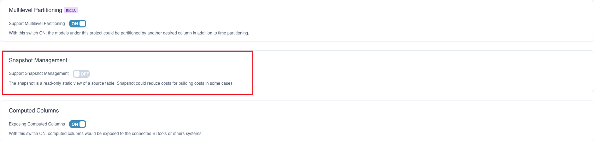
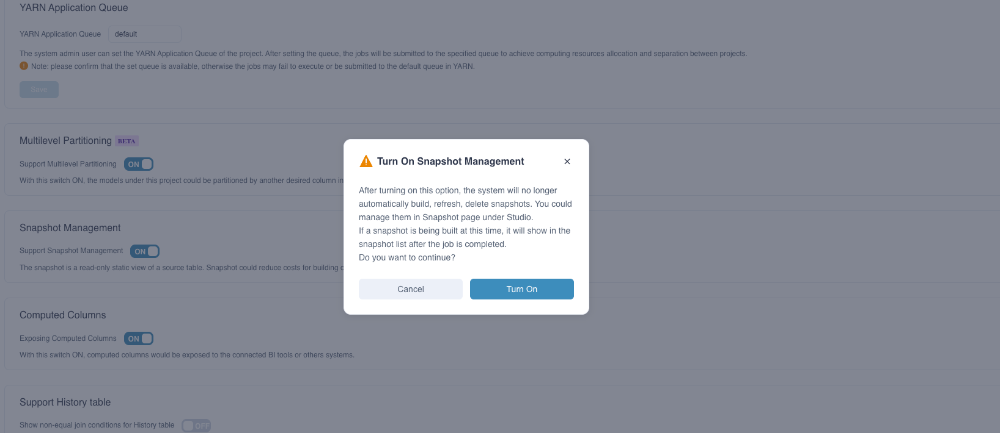
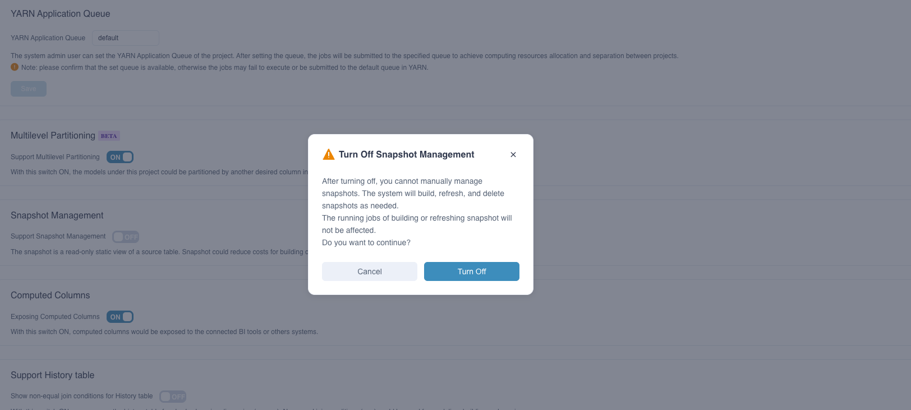
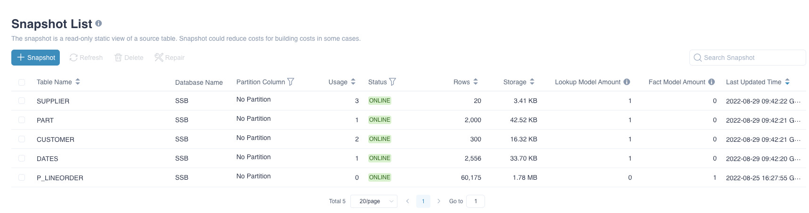
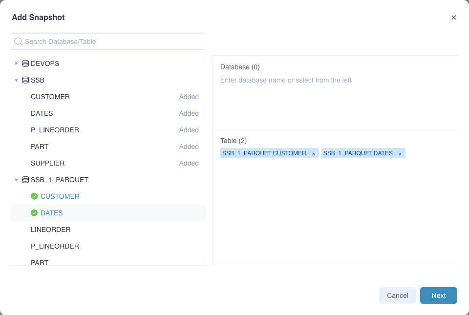
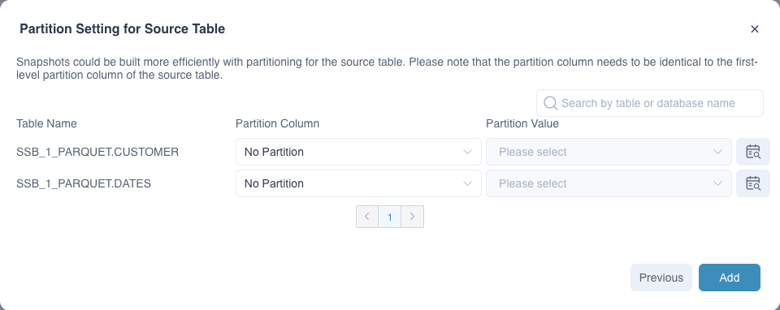
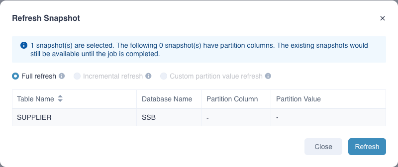
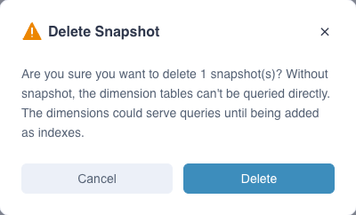
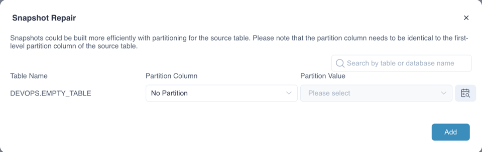

The snapshot is a read-only static view of a source table, which can be used in the following scenarios:

- Support independent query of dimension table. The snapshot will be used first to answer such queries.
- The dimensions on the dimension table can also serve the query by adding the join key to the aggregate group without generating an index, thereby avoiding the problem of dimension explosion

By default, snapshots are automatically generated by the system when loading data, building indexes, and refreshing/merging segments, and are used to store the data of the dimension tables in the model. Kylin 5.0 and later versions provide the function of independent management of snapshots. 

After the snapshot management function is enabled, the system will **no longer** automatically manage snapshots. The building, refreshing, and deletion of snapshots must be manually managed.


### <span id="switch">Enable Snapshot Management</span>

The snapshot management is disabled by default. You can enable it in advanced settings.

1. Navigate to **Settings -> Advanced Settings -> Snapshot Management**, turn on **Support Snapshot Management**.

   
   
   
   
   

**Note**:

- After the snapshot management function is enabled, the system will **no longer** automatically manage snapshots. Following are the details:
  - If a table has already built a snapshot in the system, it will be displayed in the snapshot list. When the data changes, you need to manually refresh the snapshot
  - If a table has not built a snapshot in the system, it will not be displayed in the snapshot list, and you need to build it manually

### <span id="snapshot_list">Snapshot List</span>

1. After snapshot management is enabled, you can find **Snapshot** under **Data Asset**.

2. Navigate to **Data Asset -> Snapshot**, the snapshot list will be displayed, as shown below:

   
   
   **Fields Explanation:**
   
   - **Table Name**：name of table.
   - **Database Name**：name of database.
   - **Partition Column**: partition column used in building snapshot.
   - **Usage**：usage of snapshot in querying. Update every 30 minutes.
   - **Status**：There are four statuses..
      - *LOADING* indicate the snapshot is loading and not able to serve queries.
       - *ONLINE* indicate the snapshot is online and able to serve queries.
       - *REFRESHING* indicate the snapshot is refreshing and able to serve queries with last built snapshots.
       - *BROKEN* indicate that the snapshot is damaged. When the source table has a structural change and is reloaded, the corresponding snapshot will change to this state and cannot serve the query at this time.
   - **Storage**：The storage of the snapshot ( Snappy compressed Parquet file format size ).
   - **Lookup Model Amount**：Indicate the number of models which use this table as lookup table.
   - **Fact Model Amount**：Indicate the number of models which use this table as fact table.
   - **Last Updated Time**：The last update/refresh time.


### <span id="operation">Snapshot Operations</span>

Above the snapshot lis are the operation buttons. Specific actions are listed below:

- **Add Snapshots**：Select tables or databases to build snapshots. Click **Next** to set partition columns.

   

  Next, set the snapshot partition columns. Setting snapshot partition columns can improve the building speed by building partitions in parallel to a certain extent. By default, the system will build in a non-partitioned manner. Users can also set or detect partition columns , Also support specified partition value refresh.
   > **Note**: 
   >
   > - The snapshot partition column can only be set as the Hive partition column. If the wrong partition column is used, the building task will get wrong;
   >
   > - Building in partitions can only increase the speed of the building task, and the result of the built snapshot is still full data.
   
     

- **Refresh Snapshots**：Select snapshots to refresh.
    - Full refresh: The refresh operation at this time builds the latest and full snapshot.
    - Incremental refresh: For snapshots with source table partitions set, only the newly added partition value data will be refreshed (the built historical data will not be refreshed). It is recommended to select when the historical data is not updated.
    - Custom partition value refresh: Specify single or multiple partition values for data refresh.

  


- **Delete Snapshots**：Select snapshots to delete. It will discard all jobs related to the snapshots.

   

- **Repair Snapshots**: When the source table has a structural change and is reloaded, the corresponding snapshot will change to "BROKEN" and can be repaired.

  

According building tasks of snapshot，you can configure spark related configurations in `kylin.properties` to achieve more fine-grained control.（These configuration can be overridden at project level）

The configuration starts with `kylin.engine.snapshot.spark-conf`, as shown below:
```
kylin.engine.snapshot.spark-conf.spark.executor.instances=5
kylin.engine.snapshot.spark-conf.spark.executor.cores=2
kylin.engine.snapshot.spark-conf.spark.executor.memory=12288m
kylin.engine.snapshot.spark-conf.spark.executor.memoryOverhead=3072m
kylin.engine.snapshot.spark-conf.spark.sql.shuffle.partitions=200
kylin.engine.snapshot.spark-conf.spark.driver.memory=4096m
kylin.engine.snapshot.spark-conf.spark.driver.memoryOverhead=3072m
kylin.engine.snapshot.spark-conf.spark.driver.cores=2
```
