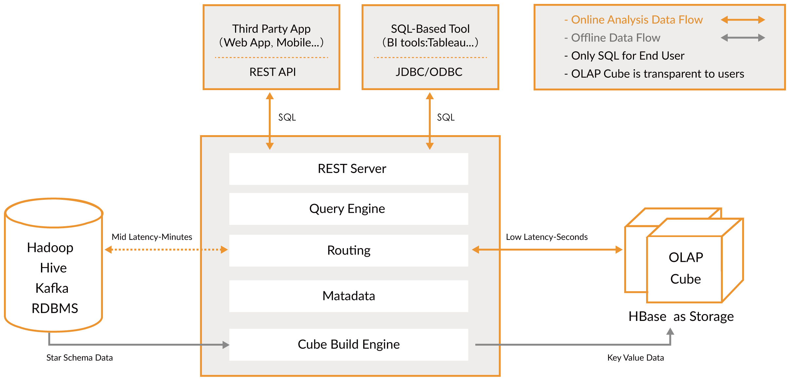

<main id="main" >
  

    

      <header style=" padding:2em 0 4em 0;">
        

          <h4 class="index-title">Bring OLAP Back to Big Data!</h4>
          

            
              
              
Apache Kylin™ is an open source, distributed Analytical Data Warehouse for Big Data; it was designed to provide OLAP (Online Analytical Processing) capability in the big data era. By renovating the multi-dimensional cube and precalculation technology on Hadoop and Spark, Kylin is able to achieve near constant query speed regardless of the ever-growing data volume. Reducing query latency from minutes to sub-second, Kylin brings online analytics back to big data.

              
Apache Kylin™ lets you query billions of rows at sub-second latency in 3 steps.

              

                <ol class="none-icon">
                  <li>
                    1
                    Identify a Star/Snowflake Schema on Hadoop.
                  </li>
                  <li>
                    2
                    Build Cube from the identified tables.
                  </li>
                  <li>
                    3
                    Query using ANSI-SQL and get results in sub-second, via ODBC, JDBC or RESTful API.
                  </li>
                </ol>
              
  
              
Apache Kylin™ can also integrate with your favorite BI tools like Tableau and PowerBI etc., to enable <b>BI on Hadoop</b>.

              
 👏👏 Please visit Kylin 5 at <a href="https://kylin.apache.org/5.0">Kylin 5.0 Home page</a>! Kylin 5 is now released. 👈 Some new features are following:

              

                <ol class="none-icon">
                  <li>
                    1
                    Smooth modeling process in one canvas which based on Vue.js
                  </li>
                  <li>
                    2
                    More flexible and enhanced data model, adding Computed Column and Table Index features
                  </li>
                  <li>
                    3
                    Toward a native and vectorized query engine
                  </li>
                 </ol>
              

            

          

        

        <!-- /container --> 
      </header>
    

    <!-- / section --> 
  

  <!-- /container -->
  <section id="second" class="main">
    <header style="background-color:#efefef;">
      

        <h4 class="index-title"> Why Apache Kylin? </h4>
        
        
        <!-- second-->
        

          

            

              

                

                  
                

                <h6><b>Timely Decision Making on Big Data</b></h6>
                
Kylin can analyze 10+ billions of rows in less than a second. No more waiting on reports for critical decisions.

              

            

            

              

                

                  
                

                <h6><b>BI on Hadoop Accelerated</b></h6>
                
Kylin connects data on Hadoop to BI tools like Tableau, PowerBI/Excel, MSTR, QlikSense, Hue and SuperSet, making the BI on Hadoop faster than ever.

              

            

            

              

                

                  
                

                <h6><b>ANSI SQL Interface for Big Data on Hadoop</b></h6>
                
As an Analytical Data Warehouse, Kylin offers ANSI SQL on Hadoop/Spark and supports most ANSI SQL query functions.

              

            

            

              

                

                  
                

                <h6><b>Interactive Queries at High Concurrency</b></h6>
                
Kylin can support thousands of interactive queries at the same time, thanks to the low resource consumption of each query.

              

            

            

              

                

                  
                

                <h6><b>Real-time OLAP for Streaming Big Data</b></h6>
                
Kylin is able to compute streaming data as soon as it is generated, allowing real-time data analysis at second-level latency.

              

            

            
 
              

                

                   
                

                <h6><b>MOLAP Cube Precalculation</b></h6>
                
Analysts can define their favorite multi-dimensional model and precalculate the cube in Kylin.

              

            

          

          

            <b>Other Highlights</b>  
            <ul class="indent">
              <li>Job Management and Monitoring </li>
              <li>Compression and Encoding Support </li>
              <li>Incremental Refresh of Cubes </li>
              <li>Leverage HBase Coprocessor for query latency </li>
              <li>Both approximate and precise Query Capabilities for Distinct Count</li>
              <li>Approximate Top-N Query Capability</li>
              <li>Easy Web interface to manage, build, monitor and query cubes </li>
              <li>Security capability to set ACL at Project/Table Level </li>
              <li>Support LDAP and SAML Integration </li>
            </ul>
            

              
            

          

        

      

      <!-- /container --> 
    </header>
  </section>
  <!-- second -->
  <section id="first" class="main">
      

        <h4 class="index-title" style="margin-top:50px;">Who is using Kylin?</h4>
        

            <!-- 1 -->
            
            
            
            
            
            <!-- 2 -->
            
             
              
            
            
            <!-- 3 -->
            
            
            
            
            
            <!-- 4 -->
            
            
            
            
            
            <!-- 5 -->
            
            
            
            
            
            <!-- 6 -->
            
            
            
            
            
            <!-- 7 -->
            
            
            
            
            
            <!-- 8 -->
            
            
            
            
            
            <!-- 9 -->             
            
                         
            
            
            
            <!-- 10 -->
            
            
            
            
            
            <!-- 11 -->
            
             
            
            
            
            <!-- 12 -->
            
            
            
            
            
            <!-- 13 -->
            
            
            
            
            
            <!-- 14 -->
            
            
            
            
              
            <!-- 15 -->
            
            
        

        <!-- /container --> 
      

    <header>
      

        <h4 class="index-title">Kylin Ecosystem</h4>
        

          

            <h6>
              Kylin Core:
            </h6> 
            
Fundamental framework of Kylin OLAP Engine comprises of Metadata Engine, Query Engine, Job Engine and Storage Engine to run the entire stack. It also includes a REST Server to service client requests

            <h6>
              Extensions:
            </h6> 
            
Plugins to support additional functions and features 

            <h6>
              Integration:
            </h6> 
            
Lifecycle Management Support to integrate with Job Scheduler,  ETL, Monitoring and Alerting Systems 

            <h6>
              User Interface:
            </h6> 
            
Allows third party users to build customized user-interface atop Kylin core

            <h6>
              Drivers:
            </h6> 
            
ODBC and JDBC drivers to support different tools and products, such as Tableau

          

          
  

        

        <!-- /container --> 
      

    </header>
  </section>  
</main>
